# Prime Auto Gallery

**Student:** Jad Abdallah
**Course:** Full Stack Development – Final Project 2026
**Institution:** Lebanese University, Faculty of Engineering – Branch 2, Roumieh

---

## Live Website

🌐 **Live URL:** https://prime-auto-gallery.onrender.com

📁 **GitHub Repository:** https://github.com/jadabdallah24/car_dealer_website_starter/tree/main

---

## Project Overview

Prime Auto Gallery is a full-stack luxury car dealership website built as a Final Project for the Full Stack Development course. The website allows users to browse a curated inventory of 18 premium and performance vehicles, filter by category, name, and price range, view detailed vehicle pages with multi-angle image galleries, book test drives, request financing, search live vehicle specifications through an external API, and interact with an AI-powered vehicle assistant.

The project uses a **Node.js + Express** backend to securely protect API keys and proxy requests to both the API Ninjas Cars API and the OpenAI Chat Completions API. The website is deployed on **Render** because it includes server-side functionality that cannot be hosted on static platforms like GitHub Pages.

---

## Main Features

* Responsive luxury automotive interface with dark glassmorphism design
* Inventory page with real-time search, category filter, and price range filter
* Dynamic vehicle details page powered by URL parameters (`?car=key`)
* Multi-photo vehicle gallery with 5 images per car (front, rear, interior, side profile)
* Previous/next navigation arrows and keyboard arrow key support
* Thumbnail strip with group pagination for galleries with more than 4 photos
* Loading animation when switching gallery images
* Live car specification search powered by API Ninjas Cars API
* Prime AI Assistant powered by OpenAI GPT-4o-mini with full inventory context
* Test drive booking form with real-time field validation
* Financing request form with real-time field validation
* Contact page with embedded Google Map and showroom photo
* About page with showroom gallery, team story, and location map
* Scroll-to-top button that appears after scrolling 300px
* Sticky frosted-glass navbar that darkens on scroll
* Fully mobile-responsive across all pages and screen sizes
* 🐧 **Easter egg** — hidden interactive feature (see below)

---

## Pages

| Page               | Description                                                                 |
| ------------------ | --------------------------------------------------------------------------- |
| `index.html`       | Homepage — hero, category cards, featured vehicles, services, CTA           |
| `inventory.html`   | Full vehicle inventory with search, category filter, and price range filter |
| `car-details.html` | Dynamic vehicle detail page — gallery, specs, modifications, damage report  |
| `api-specs.html`   | Live vehicle specification search powered by API Ninjas                     |
| `financing.html`   | Financing request form with validation                                      |
| `test-drive.html`  | Test drive booking form with date, time, and validation                     |
| `about.html`       | Dealership story, values, showroom gallery, and location map                |
| `contact.html`     | Contact form, showroom photo, info cards, and embedded Google Map           |

---

## Easter Egg 🐧

A hidden feature is built into the website as a fun interactive element.

**How to trigger it:**
Click the **Prime Auto Gallery** logo in the navbar **5 times quickly** (within 1.5 seconds).

**What happens:**
A dancing penguin appears on screen. You can **drag it around the page** with your mouse or finger on mobile. Click the × button to dismiss it.

**Implementation details:**
The easter egg is implemented as the `PenguinEasterEgg` ES6 class in `script.js`. It tracks consecutive clicks on the navbar brand element using a counter that resets after 1.5 seconds of inactivity. On the 5th click, the penguin element is revealed and made draggable via mouse and touch events. The penguin HTML element (`#penguinEasterEgg`) is included on every page but hidden by default with the `.hidden` CSS class.

---

## APIs Used

### 1. API Ninjas – Cars API

**Endpoint:** `https://api.api-ninjas.com/v1/cars`

Used on `api-specs.html` to fetch real vehicle specifications (fuel type, cylinders, transmission, drivetrain, city/highway MPG, displacement) based on make, model, and year entered by the user.

The request is proxied through the Express backend so the API key is never exposed in frontend JavaScript.

Implemented states:

* Loading spinner while fetching
* Error message if the key is invalid or the network fails
* Empty state message if no results are found
* Clean two-column result cards with all available spec fields

### 2. OpenAI – Chat Completions API (GPT-4o-mini)

**Endpoint:** `https://api.openai.com/v1/chat/completions`

Used to power the **Prime AI Assistant** chat widget available on every page of the website.

The OpenAI API key is stored in `.env` and loaded server-side only — it is never sent to or visible in the browser.

The assistant is given the full vehicle inventory as a system prompt context and is instructed to only respond to questions about Prime Auto Gallery vehicles, comparisons, financing guidance, and test drive bookings.

Implemented features:

* Quick suggestion buttons (e.g. *Best coupe under $80,000*, *Compare M4 and RS7*)
* "Thinking…" loading indicator while waiting for a response
* Graceful fallback messages for quota exceeded, invalid key, or server offline
* User messages displayed in gold, bot replies in dark glass bubbles

---

## Backend

The backend is a lightweight **Node.js + Express** server in `server.js`.

It handles two API proxy routes:

| Route       | Method | Purpose                                                  |
| ----------- | ------ | -------------------------------------------------------- |
| `/api/cars` | GET    | Proxies requests to API Ninjas Cars API                  |
| `/api/ai`   | POST   | Sends messages to OpenAI and returns the assistant reply |

Static files (HTML, CSS, JS, images) are also served from the same Express server using `express.static`.

The backend is required because API keys must never be placed directly in frontend JavaScript files — they would be visible to anyone who opens the browser developer tools.

---

## Running Locally

**Step 1 — Install dependencies**

```bash
npm install
```

**Step 2 — Create the `.env` file**

Create a file named `.env` in the same folder as `server.js` and add your keys:

```env
API_NINJAS_KEY=your_api_ninjas_key_here
OPENAI_API_KEY=your_openai_key_here
```

**Step 3 — Start the server**

```bash
node server.js
```

or:

```bash
npm start
```

**Step 4 — Open the website**

```text
http://localhost:3000
```

> ⚠️ If you see `EADDRINUSE: address already in use :::3000`, another process is still using the port.
> Run `netstat -ano | findstr :3000` in PowerShell, find the PID number on the right, then run
> `taskkill /PID <number> /F` to stop it. Then run `node server.js` again.

---

## Environment Variables

The `.env` file is **not included** in the GitHub repository for security reasons.

Required variables:

```env
API_NINJAS_KEY=your_api_ninjas_key_here
OPENAI_API_KEY=your_openai_key_here
```

On Render, these are set directly in the **Environment** tab of the service dashboard — no `.env` file is needed on the server.

---

## Custom UI Requirement — Scroll-to-Top Button

The scroll-to-top button is the custom UI feature implemented for this project.

Behaviour:

* Hidden by default
* Fades and slides in after the user scrolls more than 300px
* Fixed in the bottom-right corner on every page
* Smoothly scrolls the page back to the top when clicked
* Fades back out when the user returns to the top

Implementation: the `ScrollToTop` ES6 class in `script.js` listens for the `scroll` event and toggles a `.show` CSS class that triggers the fade/slide transition defined in `styles.css`.

---

## JavaScript Classes

| Class                    | File          | Purpose                                                                          |
| ------------------------ | ------------- | -------------------------------------------------------------------------------- |
| `ScrollToTop`            | `script.js`   | Scroll-to-top button with show/hide animation                                    |
| `ButtonLoadingAnimation` | `script.js`   | Temporary spinner on `.hero-btn` click                                           |
| `InventoryFilter`        | `script.js`   | Filters inventory cards by name, category, and price range                       |
| `FormValidator`          | `script.js`   | Real-time inline validation and success/error alert on submit                    |
| `CarDetails`             | `script.js`   | Reads `?car=` URL parameter and populates car-details.html with data and gallery |
| `PenguinEasterEgg`       | `script.js`   | Hidden interactive easter egg triggered by clicking the logo 5 times             |
| `PrimeAIChat`            | `ai-chat.js`  | AI chat widget — POSTs to `/api/ai` and displays the assistant reply             |
| `ApiCarsSearch`          | `api-cars.js` | GETs `/api/cars` and renders live vehicle specification cards                    |

---

## Inventory

18 vehicles across 5 categories. Each vehicle includes a name, badge, price, mileage, transmission, drivetrain, engine, power output, colour, full description, modifications list, damage report status, and 5 gallery photos.

| Category  | Vehicles                                                                                                                         |
| --------- | --------------------------------------------------------------------------------------------------------------------------------- |
| Coupe     | BMW M4 Competition, BMW M4 Silver Surfer Spec, Chevrolet Corvette Stingray, Toyota GT86 TRD                                       |
| Supercar  | Porsche 911 Turbo S, Corvette ZR1, McLaren 765LT Batman Spec, Ferrari 488 Pista, Ferrari 812 Competizione, Lamborghini Revuelto    |
| SUV       | Mercedes-Benz GLE 450, Mercedes-Maybach GLS 600, Range Rover Sport SVR                                                            |
| Sedan     | Audi S4 Premium, Audi RS7 ABT Legacy                                                                                              |
| Hatchback | Volkswagen Golf R, GR Yaris Rally Spec, Honda Civic Type R                                                                        |

---

## Design

| Element    | Detail                                                                                     |
| ---------- | ------------------------------------------------------------------------------------------ |
| Theme      | Dark luxury — obsidian backgrounds, champagne gold accents                                 |
| Fonts      | Cormorant Garamond (headings) · Inter (body)                                               |
| Effects    | Glassmorphism panels, gold hairline rules, grain texture overlay, shimmer button animation |
| Navbar     | Frosted glass, transparent on load, darkens on scroll                                      |
| Buttons    | Black background with gold border and gold text; fills gold on hover                       |
| Responsive | 3-col → 2-col → 1-col grid, collapsible Bootstrap navbar                                   |

---

## Deployment

The website is deployed on **Render** at:
**https://prime-auto-gallery.onrender.com**

Render was chosen because the project includes a Node.js backend. GitHub Pages and Netlify only support static frontend hosting and cannot run an Express server.

Deployment steps used:

1. Push the project to GitHub (excluding `.env` and `node_modules/`)
2. Create a new **Web Service** on Render
3. Set the root directory to the folder containing `server.js` and `package.json`
4. Set build command: `npm install`
5. Set start command: `node server.js`
6. Add `API_NINJAS_KEY` and `OPENAI_API_KEY` in the Render **Environment** tab

---

## Security

Files excluded from GitHub via `.gitignore`:

```text
.env
node_modules/
```

The `.env` file contains private API keys and must never be committed to a public repository. Environment variables are configured directly in the Render dashboard for production deployment.

---

## Issues Encountered and How They Were Fixed

### 1. API Key Accidentally Pushed to GitHub

The `.env` file was committed to GitHub by mistake early in development. It was removed from Git tracking using `git rm --cached .env`, added to `.gitignore`, and the affected API keys were rotated immediately.

### 2. OpenAI Quota Error (HTTP 429)

The AI assistant returned a `429 insufficient_quota` error when the OpenAI account had no active billing credits. The backend was updated to catch this specific error code and return a friendly message to the frontend instead of crashing the widget.

### 3. Render Deployment — Root Directory Error

Render initially failed to start the server because `package.json` was not found at the repository root. The Render root directory setting was corrected to point to the subfolder containing `server.js`.

### 4. Thumbnail CSS Bleed

The thumbnail images on the car details page were inheriting styles from the main vehicle image selector. The CSS was fixed by using a specific selector (`#detailImage`) for the main image and a separate class (`.thumb-img`) for thumbnails so the styles no longer conflict.

### 5. EADDRINUSE Port Conflict

Running `node server.js` twice without stopping the first instance caused a port conflict on 3000. Fixed by identifying the process ID with `netstat -ano | findstr :3000` and terminating it with `taskkill /PID <id> /F` before restarting the server.

### 6. Car Details Page Showing Nothing

The `car-details.html` page was completely blank because `script.js` was missing the `CarDetails` class entirely. The HTML placeholders existed but nothing was reading the `?car=` URL parameter or populating the page. The `CarDetails` class was written and added to `script.js`, and the script load order was corrected so `car-data.js` loads before `script.js`.

### 7. API Ninjas "Invalid API Key" Error

The Cars API search returned `"Invalid API Key"` even after confirming the key matched what was stored in `.env`. The first fix was discovering that `api-cars.js` had an old hardcoded key baked directly into the frontend JavaScript and was calling API Ninjas directly from the browser instead of going through the Express backend. This was corrected so the frontend calls `/api/cars` on the local server, which proxies the request using `API_NINJAS_KEY` from `.env`. The original key itself also turned out to be invalid at the source (confirmed with a direct `curl` test against the API Ninjas endpoint), so the key was regenerated from the API Ninjas dashboard and the `.env` file was updated with the new value.

### 8. GitHub Push Protection Blocked a Commit Containing an API Key

A push was rejected by GitHub's secret scanning push protection because an earlier commit included the OpenAI API key inside `car_dealer_website/.env`. Since the key had already been rotated, the secret was marked as resolved directly through GitHub's "I've already rotated/revoked this secret" option on the blocked-secret URL provided in the error message, which allowed the push to go through without rewriting git history. `.env` was confirmed to be listed in `.gitignore` going forward to prevent any future commits from including it.

---

## Future Improvements

* Favourite vehicles saved with `localStorage`
* Side-by-side vehicle comparison tool
* Recently viewed vehicles section
* Admin panel for managing inventory
* Real database integration (MongoDB or PostgreSQL)
* User authentication for admin access
* WhatsApp or direct messaging integration
* Vehicle availability status management

---

## Technologies Used

| Technology            | Purpose                                               |
| ---------------------- | ----------------------------------------------------- |
| HTML5                 | Page structure and semantic markup                    |
| CSS3                  | Styling, glassmorphism, animations, responsive layout |
| Bootstrap 5.3.3       | Navbar, grid system, utility classes                  |
| JavaScript ES6        | Classes, DOM manipulation, event handling             |
| Node.js               | Backend runtime                                       |
| Express.js            | API proxy routes and static file serving              |
| dotenv                | Secure environment variable loading                   |
| OpenAI Node.js SDK v4  | OpenAI API integration                                |
| API Ninjas Cars API   | Live vehicle specification data                       |
| Font Awesome 6.5      | Icons throughout the site                             |
| Google Fonts          | Cormorant Garamond + Inter typography                 |
| Render                | Full-stack deployment platform                        |
| GitHub                | Version control and source hosting                    |

---

## AI-Use Appendix

### Tools Used

| Tool               | Purpose                                                                                                                         |
| ------------------- | ------------------------------------------------------------------------------------------------------------------------------- |
| Claude (Anthropic) | Code review, Bootstrap migration, ES6 class architecture, form validation, AI chat integration, UI/UX design, debugging, README |

### Sample Prompts Used

1. *"Review my car dealership website and tell me what I should improve to match the project requirements."*

2. *"Help me connect API Ninjas Cars API to my website using a Node.js backend so the API key is not exposed."*

3. *"Create a car details page where the image is on the left, the specifications are on the right, and thumbnails under the image change the main picture."*

4. *"Help me add an AI assistant to my car dealership website using OpenAI and Express."*

5. *"Write a CarDetails ES6 class that reads the ?car= URL parameter, looks it up in carDatabase, and populates all the placeholder elements on car-details.html including the thumbnail gallery with prev/next arrows."*

6. *"Help me deploy my Node.js project on Render and fix the deployment errors."*

### What the AI Got Wrong

**1. Bootstrap navbar background override**
Claude's initial Bootstrap nav used `bg-dark` which turned the navbar black on all pages including the hero where the background should be transparent. I removed `bg-dark` and added `background: transparent !important` in CSS, then added a dark background only on the collapsed mobile drawer via a media query.

**2. `card.style.display = "block"` breaking the flex layout**
The AI reset hidden cards to `display: block`, which pulled them out of the flex row and caused a single-column broken layout after clearing filters. I fixed it by resetting to `""` (empty string) so CSS's original `display` value from the stylesheet takes over.

**3. Wrong OpenAI SDK method**
The initial `server.js` used `openai.responses.create` with a non-existent model name. I corrected it to `openai.chat.completions.create` with `gpt-4o-mini`.

---

## Screenshots

All screenshots are stored inside the `car_dealer_website/screenshots/` folder.

---

### Home Page

The homepage includes the hero section, navbar, vehicle categories, featured inventory, services, and call-to-action content.

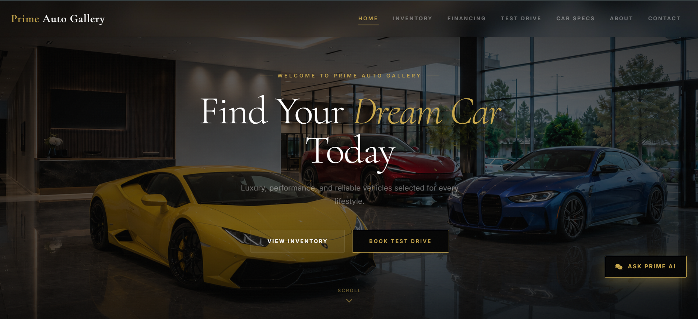

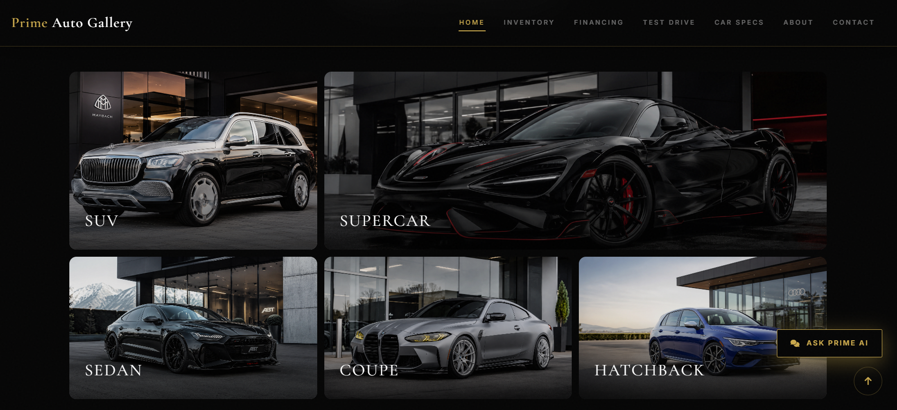

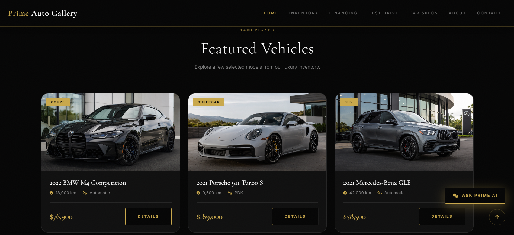

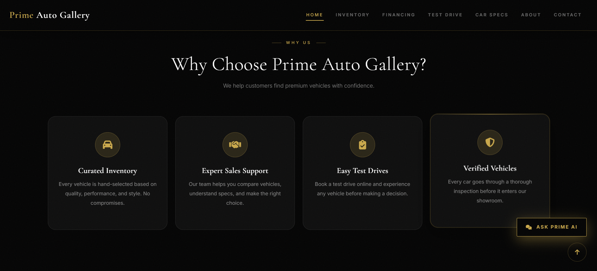

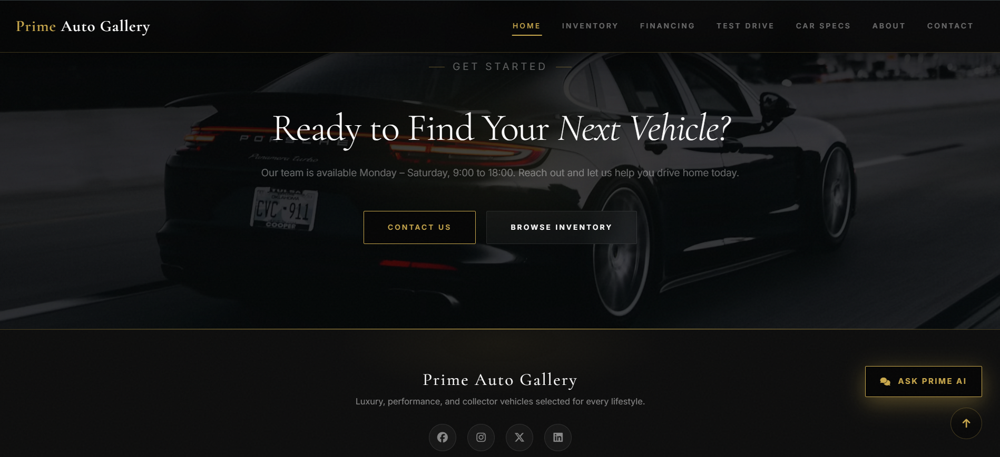


---

### Inventory Page

The inventory page displays the complete vehicle list and includes filtering by vehicle name, category, and price range.

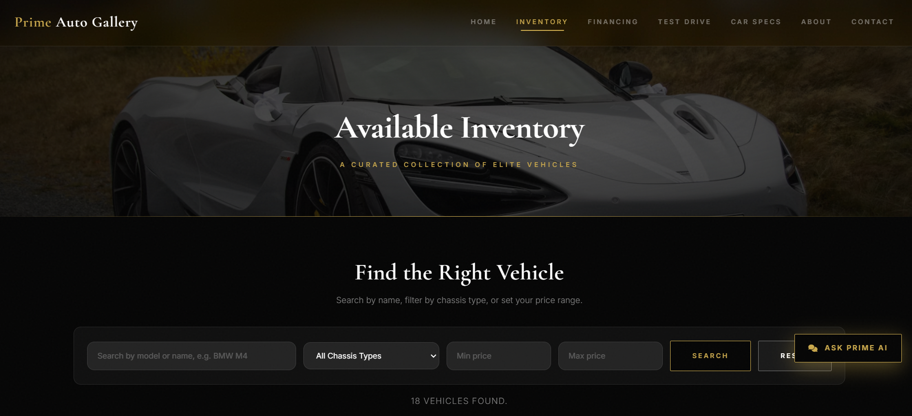

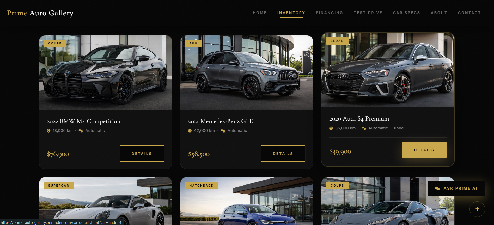

---

### Car Details Page

The car details page presents an individual vehicle with a large image gallery, detailed specifications, modifications, damage report, and overview.

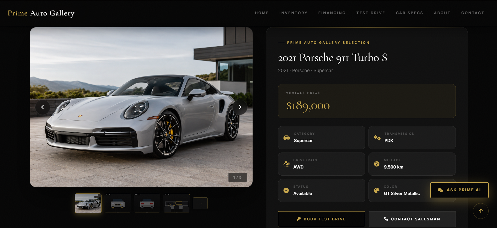

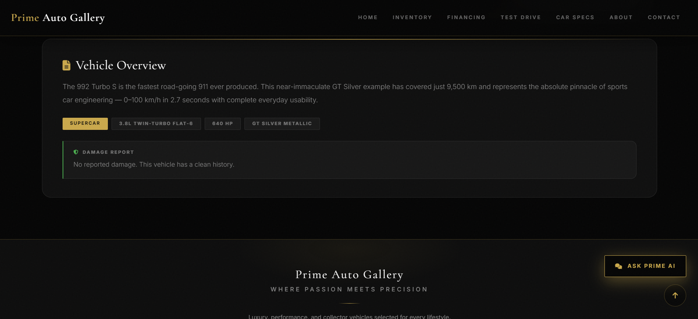

---

### Financing Page

The financing page includes a financing application form with validation and styled input sections.

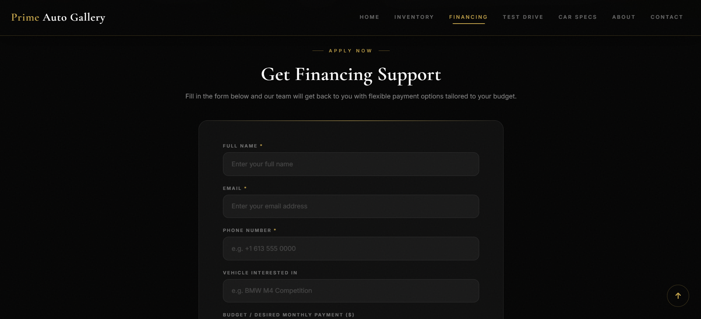

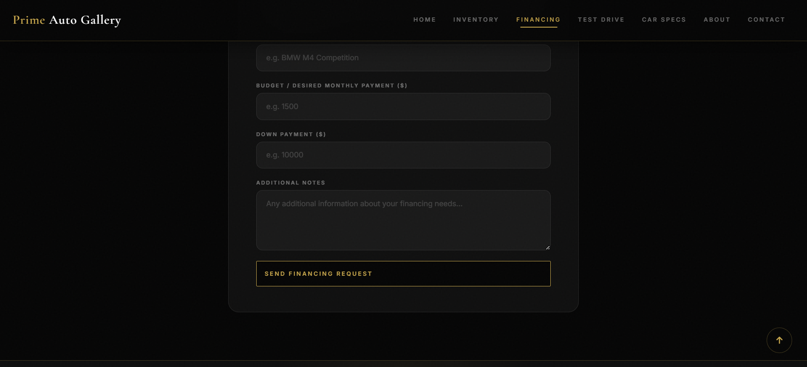

---

### Test Drive Page

The test drive page allows users to book a test drive by selecting their preferred vehicle, date, time, and contact information.

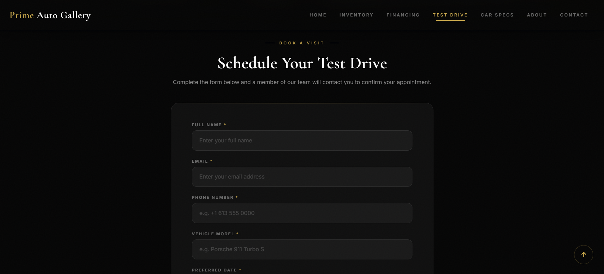

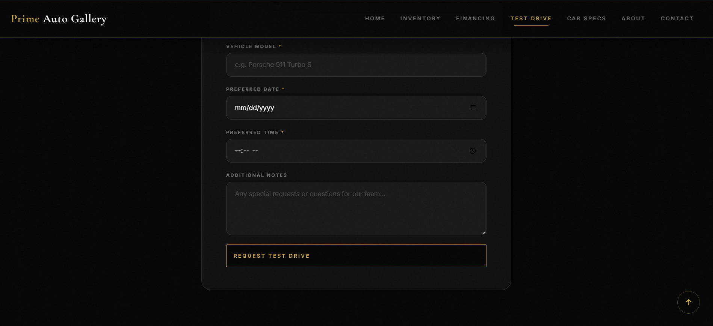

---

### API Specs Page

The API Specs page allows users to search for real vehicle specifications using the API Ninjas Cars API.

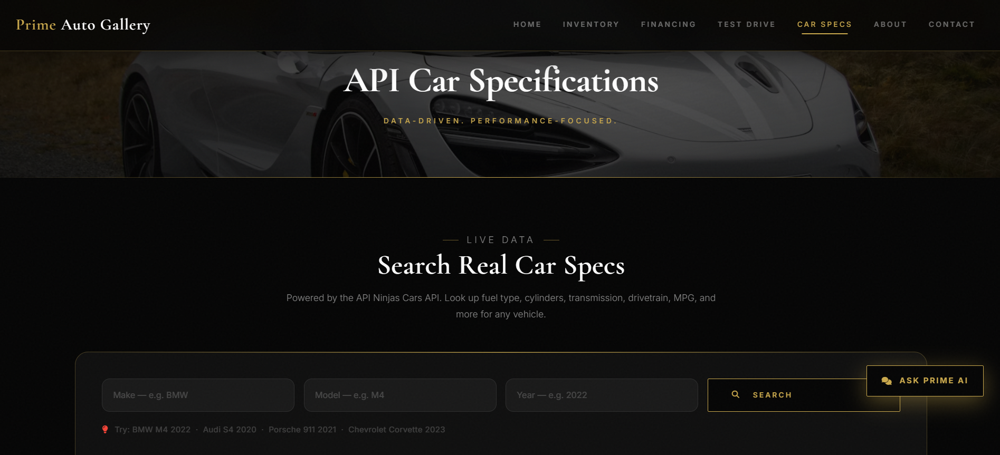

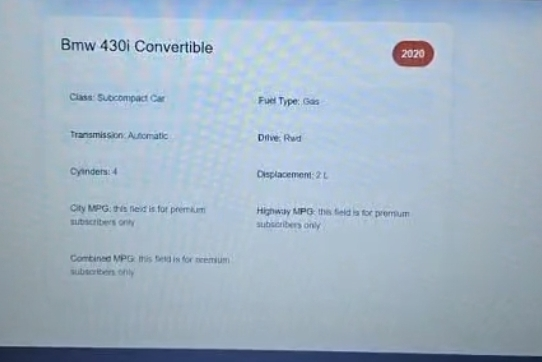

---

### About Page

The About page presents the dealership story, values, showroom sections, and visual brand identity.

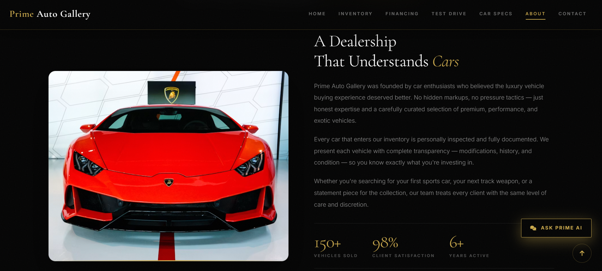

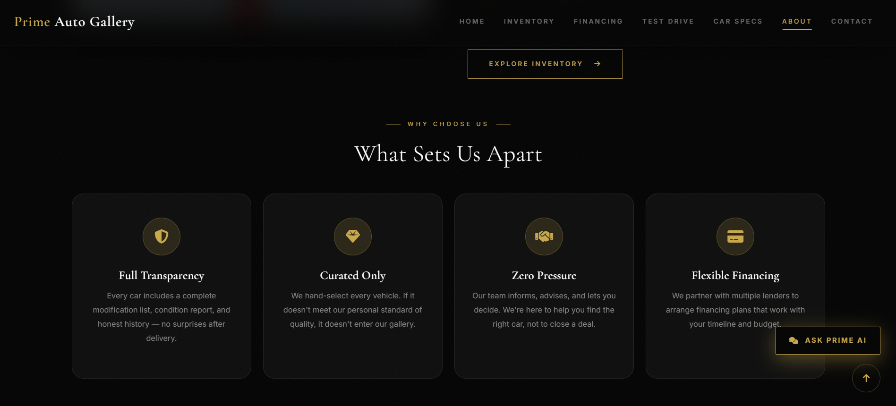

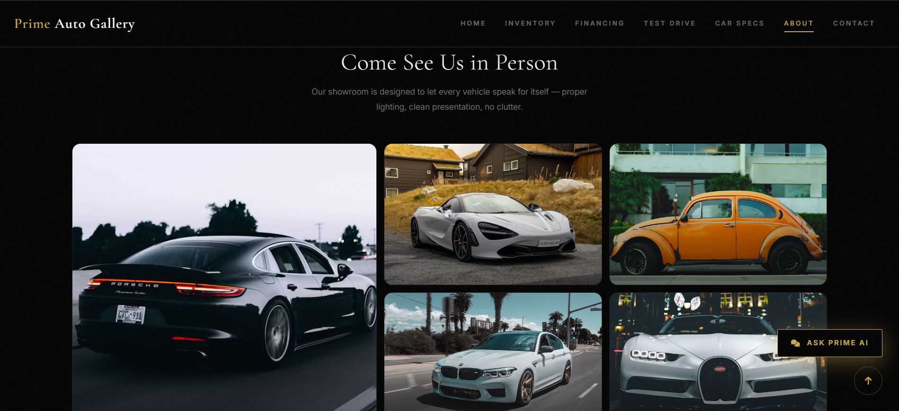

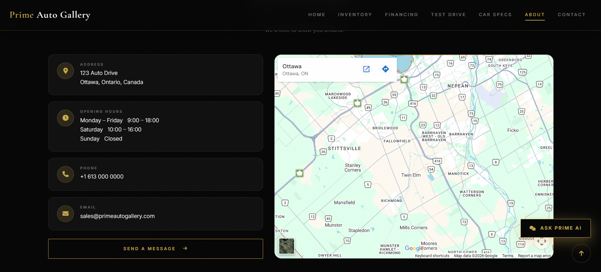

---

### Contact Page

The Contact page includes contact information, a contact form, showroom details, and location section.

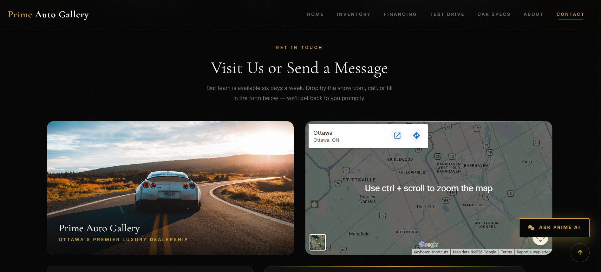

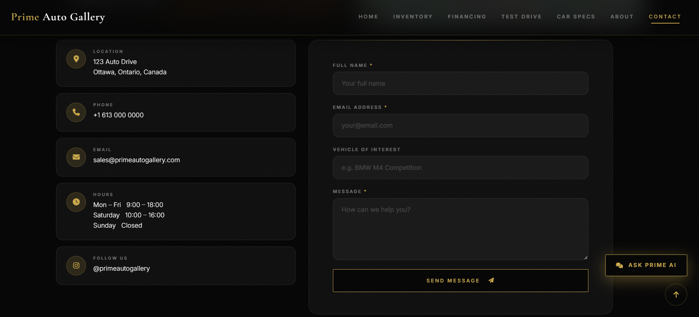

---

## Conclusion

Prime Auto Gallery is a complete full-stack luxury car dealership website that combines responsive frontend design, dynamic JavaScript functionality, external API integration, a secure Node.js backend, and an AI-powered assistant. The project also includes a custom easter egg as an additional interactive feature. It demonstrates skills in semantic HTML, advanced CSS with glassmorphism and custom properties, ES6 class-based JavaScript, REST API consumption, backend development with Express, environment variable security, and production deployment with Render.
